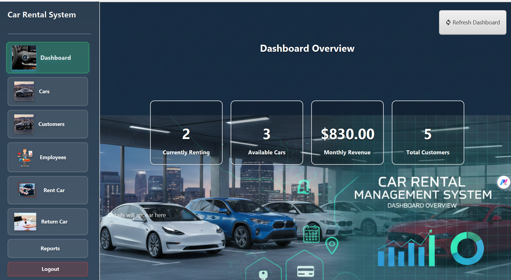
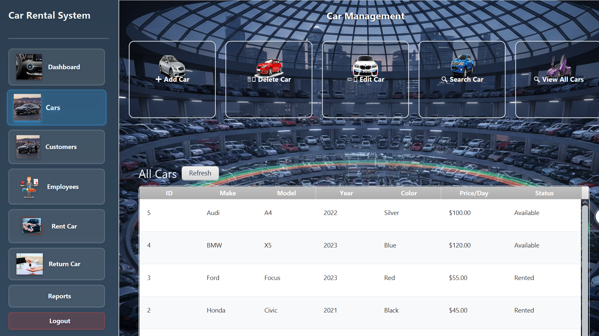
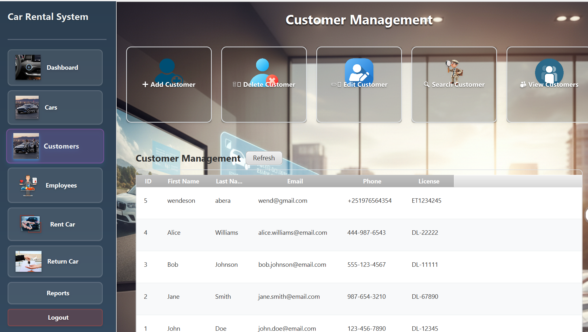
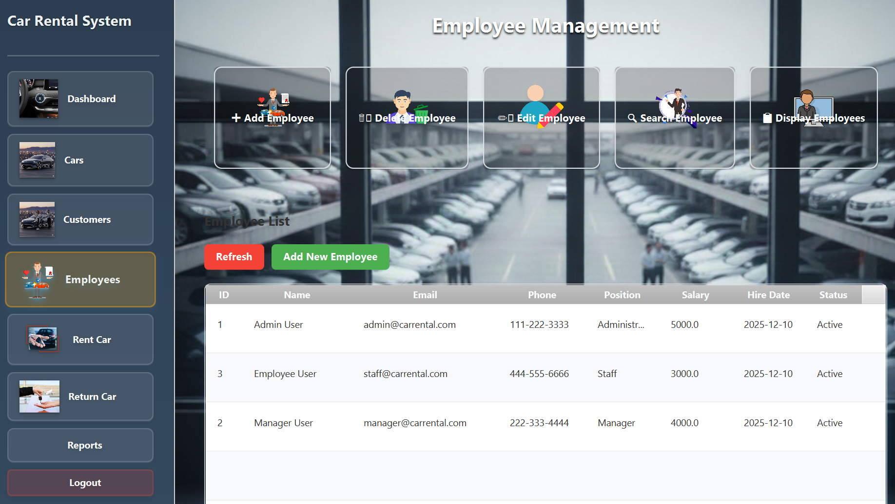
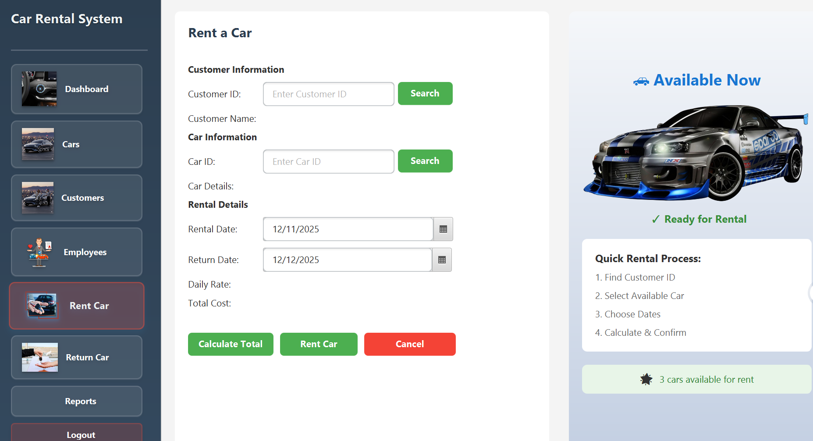
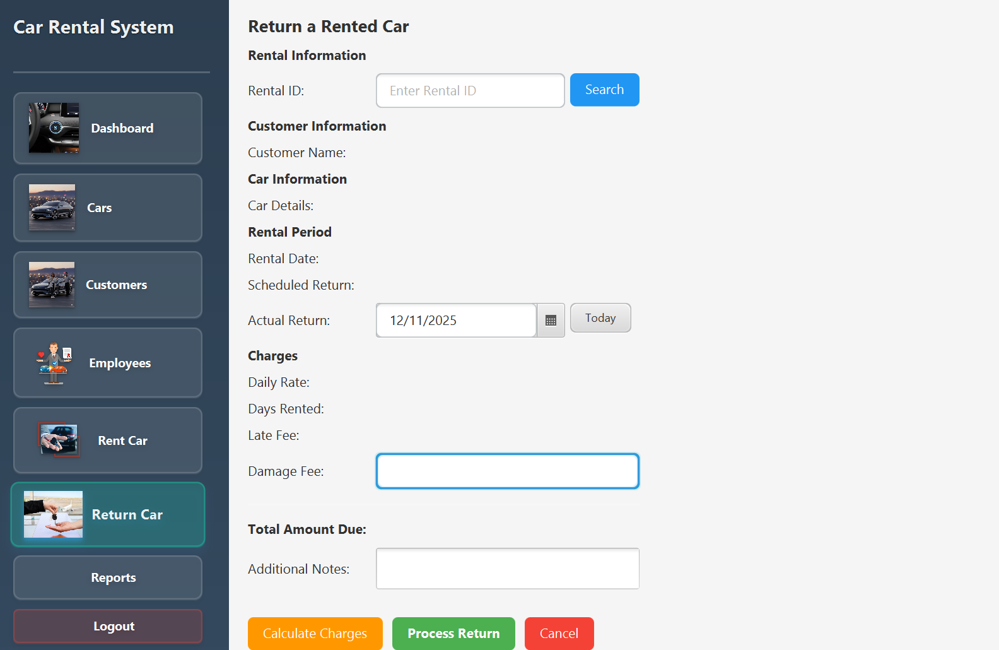
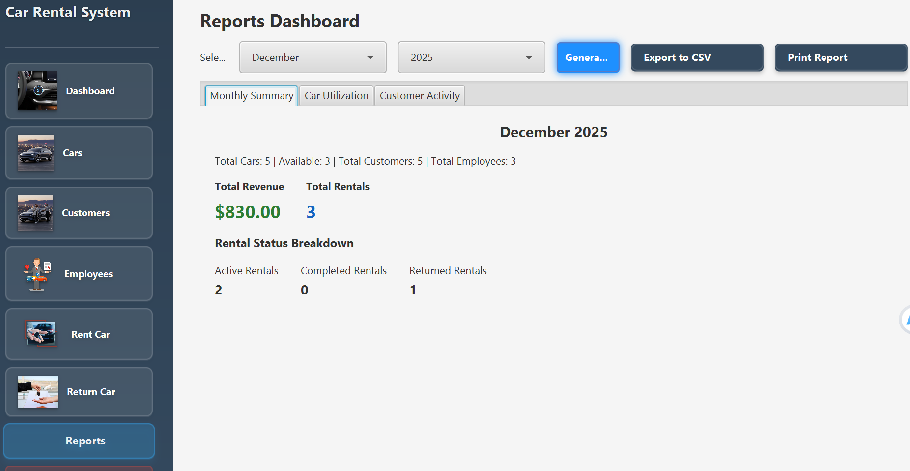
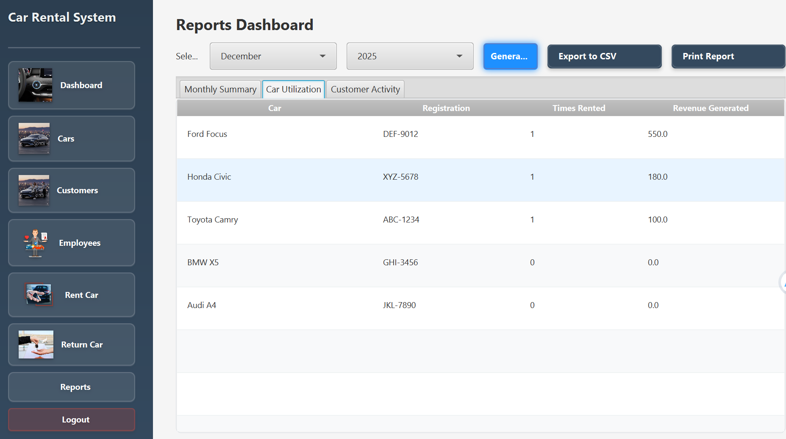
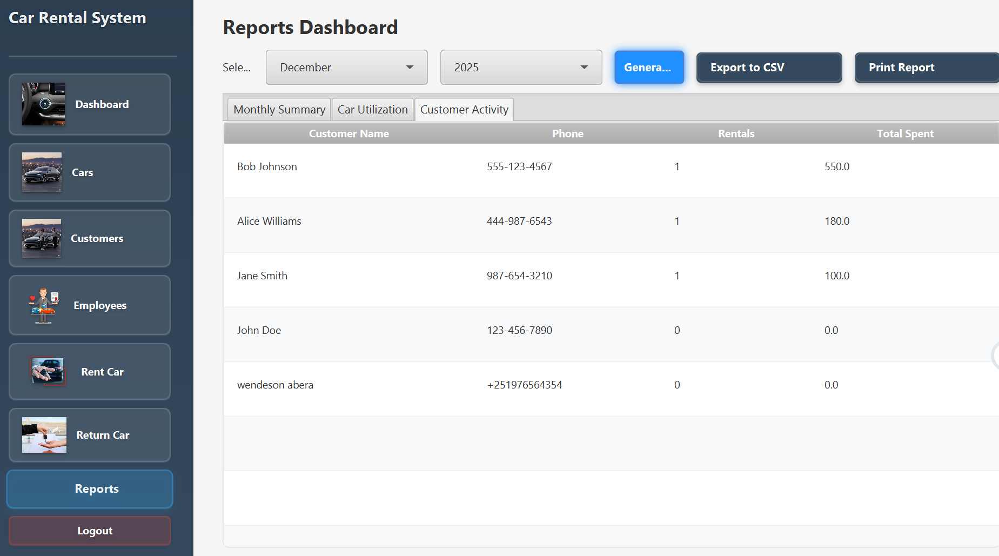

# Car Rental Management System

A JavaFX-based application for managing car rentals, customers, employees, and rental transactions.

## Project Structure

This project follows a clean architecture pattern with separation of concerns:

- **application/**: Main application entry point and navigation
- **controllers/**: FXML controllers for UI components
- **dao/**: Data Access Objects for database operations
- **services/**: Business logic layer
- **models/**: Entity classes
- **resources/**: FXML files, CSS styles, images, and database schema

## Technologies

- JavaFX for UI
- MySQL/SQLite for database
- JDBC for database connectivity

## Setup

1. Configure database connection in `application/DatabaseConnection.java`
2. Run database schema from `resources/database/schema.sql`
3. Build and run the application
## Project Interface

# login page:

## Dashboard

## Manage all cars add,edit, delet,search and display

## Manage customer

## Manage employee

## Rent car

##  Return Cars

## View and genrate monthly summery activity reports

## View and generate monthly car activities report

## monthly customer utilization report

